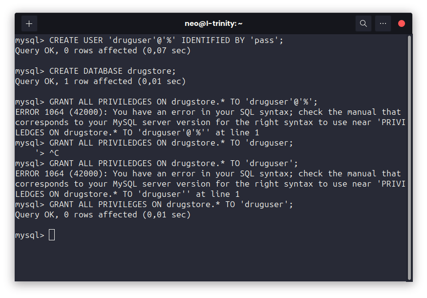
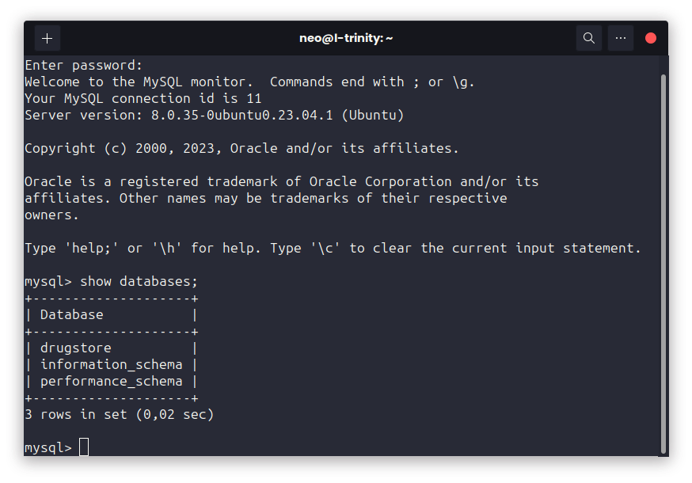

CREATION DE LA BASE DE DONNEES

Test de connection 

Commandes pour linux
    Compilation:  
        javac esp/dstib/drugmanagement/Application.java  
    Execution  
        java -cp .:mysql-connector-java-8.0.30.jar esp.dstib.drugmanagement.Application 

Commandes pour windows (Utiliser CMD pas PowerShell)   
    Compilation:  
        javac esp/dstib/drugmanagement/Application.java  
    Execution  
        java -cp mysql-connector-java-8.0.30.jar;. esp.dstib.drugmanagement.Application 
